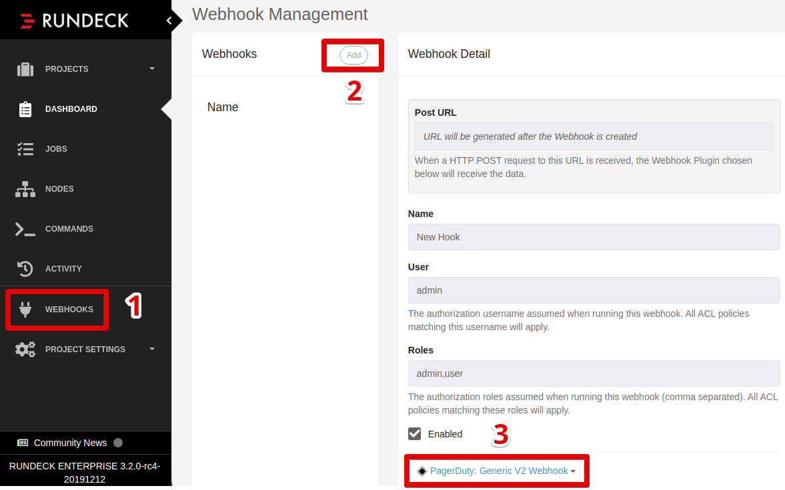
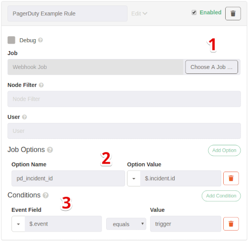
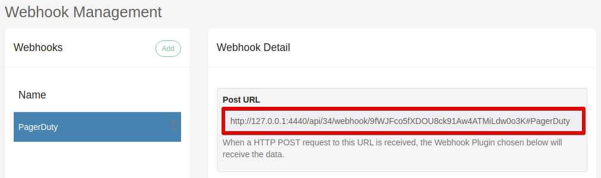
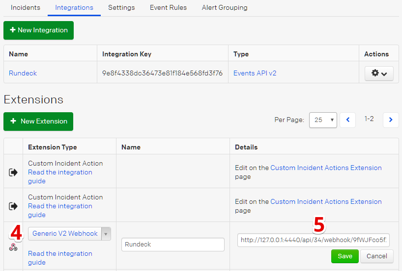

# PagerDuty (Enterprise)
Rundeck's **PagerDuty: Generic V2 Webhook** plugin makes it easy
to automatically run jobs in response to PagerDuty events.

Jobs can be executed in response to many events such as incident `trigger`
and `resolve`, or even in reponse to **custom actions**.

## Getting Started
This section will guide you through configuring a basic PagerDuty Webhook.
The configuration will run a **Job** when PagerDuty send rundeck an incident
`trigger` event.

### Create Rundeck Webhook
1. Navigate to **Webhooks**
2. Click **Add**
3. Select **PagerDuty: Generic V2 Webhook**

### Customize Sample Rule
1. Click **Choose A Job** to select a job to run when the rule matches.
2. Customize the **Job Options**:  
   The sample will set the job's `pd_incident_id` option to the PagerDuty incident ID inside the event
3. Customize **Conditions**:  
   The sample condition will match for `trigger` event types. See [Webhook Types](https://v2.developer.pagerduty.com/docs/webhooks-v2-overview#webhook-types) for a list of PagerDuty event types.
4. Save the Webhook

::: tip
Use the suggestion dropdowns to chose from common PagerDuty event fields
:::

### Add Webhook to PagerDuty

1. Select the Webhook by name in **Webhook Management** and copy the **Post URL** :
   

2. *In **PagerDuty*** navigate to **Configuration** -> **Services**
3. Select the **Integrations** tab and click **New Extension**
4. For the **Extension Type** select **Generic V2 Webhook**
5. Enter the **Post URL** into the **URL** field from step **1**:  
   