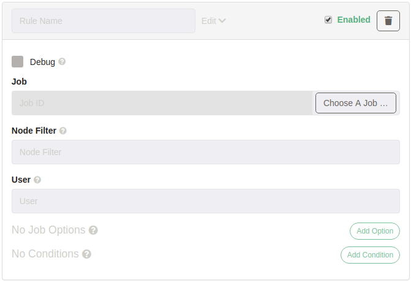
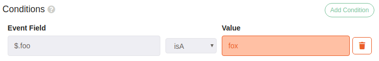

# Routing Run Job (Enterprise)
:::danger
Webhooks and the Enterprise routing rule plugin are currently in beta.
There may be breaking API changes between releases!
:::

The powerful Enterprise Routing Rule webhook handler enables selective execution
of one or more jobs based by evaluating event data.

Each event passes through one or more routing rules. If the event satisfies the rule
conditions the target job will be executed with the supplied job options. Conditions and job
options can be constructed from event data!

## General Settings


### Batch Key (optional)
The batch key makes it possible to extract a list from
the event and run each item through the rule processing.

**Given:**
```json
{
    "messages": [
        {"msg": "foo"},
        {"msg": "bar"}
    ]
}
```

The batch key `$.messages` could be used to process each item
individually.

:::tip
The batch key supports JsonPath deep scanning. A key
such as `$.messages[*].alerts` could be used to extract nested lists
and process the items individually. Lists are recursively flattened.
:::

### Event ID Key (optional)
The event ID key can be used to replace the ID auto generated when
webhook events are received. This will be reflected in the logs. Batches
are extracted before applying the event ID key to each item.

## Rules

:::tip
Rules can be individually enabled/disabled!
:::

Each webhook event gets evaluated against each rule. If the rule matches
(all conditions are satisfied) the target job will be executed.

### Name (optional but srsly)
A label to identify the rule.

### Debug
Rule evaluation debug info can be printed to the `INFO` log level by selecting the debug option. This can make it easier to troubleshoot rules while reducing noise.

### Job
Use the job picker to select a job target. If the rule evaluation is a match the target
job will be executed with the Job Options.

### Node Filter (optional)
Used to override the job node filter. You can use a [JsonPath](#jsonpath) or [Template](#template) to craft a node filter from the event data.

### User (optional)
Optionally override the user the job runs as. This can be crafted from event data just
like [Node Filter](#node-filter)

### Job Options
Job options to be supplied during job execution. Use [JsonPath](#jsonpath) or
[Templates](#templates) to construct the `value` from event data.

### [Conditions](#conditions)
See [Conditions](#conditions)

## Conditions


### Policy
* **all** All conditions must match
* **any** At least one condition must match

### contains
Satisfied if the value at `path` contains the provided `value`.
### dateTimeAfter
### dateTimeBefore
:::warning
Must be a Date with Time.
:::
Compares the parsed Zoned DateTime at `path` with the provided DateTime.
Supported formats are:
* [ISO_DATE_TIME](https://docs.oracle.com/javase/8/docs/api/java/time/format/DateTimeFormatter.html#ISO_DATE_TIME)
* [ISO_INSTANT](https://docs.oracle.com/javase/8/docs/api/java/time/format/DateTimeFormatter.html#ISO_INSTANT)
* Unix EPOCH (assumed to be in milliseconds if year >=2970)

The format in the event need not match the format of the value.

### exists
Satisfied if _Something_ exists at the specified path.
### matches
Matches is satisfied if the value at `path` _equals_ the value of
the provided `value`.
### isA
Satisfied if the type at `path` match a provided `value` of:
- string
- number
- map
- list
- null

## JsonPath/Templates
Many fields accept a JsonPath or template string. The discriminating criteria are:
* **JsonPath:** Starts with `$`
* **Template:** Starts with `\$` or `/^[^$]/`

### JsonPath
:::tip
A JsonPath that selects a data structure(list or map)
will return the data structure as serialized JSON.
:::

JsonPath allows for very flexible event data extraction.

See [Path Examples](https://github.com/json-path/JsonPath#path-examples) in the JsonPath
repo for easy examples and inspiration.

### Template
In a string template values are substituted with `${}`.

```json
{"foo":"bar"}
```

Event data can be accessed in `${data}`:  
`The value is ${data.foo}` -> `The value is bar`

JsonPath can be used too!:  
`The value is ${path('$.foo')}` -> `The value is bar`


## FAQ
### How do I pass the raw event data to a job?
You can use the [JsonPath](#jsonpath) `$.` as a job option value to send the event as a serialized
JSON. You can also send parts of the event by crafting a JsonPath that returns structured
data!